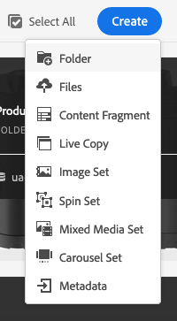
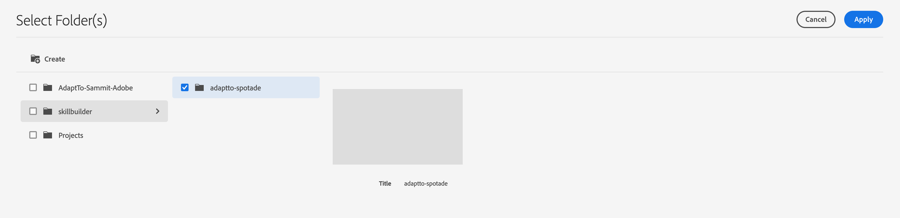
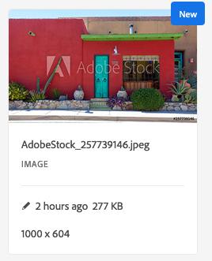
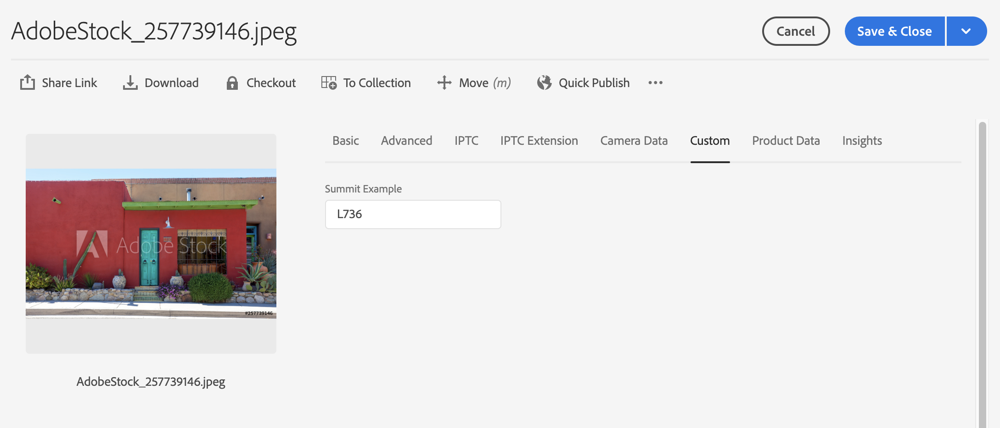

# Frictionless Migration to AEM Assets as a Cloud Service - Workshop

## Table of Contents

- [Frictionless Migration to AEM Assets as a Cloud Service - Workshop](#frictionless-migration-to-aem-assets-as-a-cloud-service---workshop)
  - [Table of Contents](#table-of-contents)
  - [Workshop Overview](#workshop-overview)
    - [Key Takeaways](#key-takeaways)
    - [Prerequisites](#prerequisites)
- [Lesson 1 - Review Existing Project Structure](#lesson-1---review-existing-project-structure)
  - [Objective](#objective)
  - [Lesson Context](#lesson-context)
    - [Exercise 0 - Setup Local AEM Environment](#exercise-0---setup-local-aem-environment)
    - [Exercise 1.1 - Review existing project structure](#exercise-11---review-existing-project-structure)
    - [Exercise 1.2 - Review DAM Update Asset workflow in local AEM 6.5](#exercise-12---review-dam-update-asset-workflow-in-local-aem-65)
    - [Exercise 1.3 - Upload an asset](#exercise-13---upload-an-asset)
    - [Bonus Exercise - Review source](#bonus-exercise---review-source)
- [Lesson 2 - Run the Migration Tool](#lesson-2---run-the-migration-tool)
  - [Objective](#objective-1)
  - [Lesson Context](#lesson-context-1)
    - [Exercise 2.1 - Execute the AEM workflow migration tool](#exercise-21---execute-the-aem-workflow-migration-tool)
    - [Exercise 2.2 - Review the migration report](#exercise-22---review-the-migration-report)
    - [Bonus Exercise - Review code changes](#bonus-exercise---review-code-changes)
- [Lesson 3 - Cloud Manager Deployment Demo](#lesson-3---cloud-manager-deployment-demo)
  - [Bonus Exercise](#bonus-exercise)
- [Lesson 4 - Test Changes on AEM as Cloud Service](#lesson-4---test-changes-on-aem-as-cloud-service)
  - [Objective](#objective-2)
  - [Lesson Context](#lesson-context-2)
    - [Exercise 4.1 - Log in to AEM as a Cloud Service](#exercise-41---log-in-to-aem-as-a-cloud-service)
    - [Exercise 4.2 - Review the updated DAM Update Asset workflow](#exercise-42---review-the-updated-dam-update-asset-workflow)
    - [Exercise 4.3 - Review the generated processing profile and attach it to a folder](#exercise-43---review-the-generated-processing-profile-and-attach-it-to-a-folder)
    - [Exercise 4.4 - Upload assets](#exercise-44---upload-assets)
    - [Bonus Exercise](#bonus-exercise-1)
  - [Next Steps](#next-steps)
- [Additional Resources](#additional-resources)

## Workshop Overview

Adobe Experience Manager Assets as a Cloud Service and Asset Microservices provide the means to drive higher scalability for asset processing. To take advantage of the enhancements requires migrating your existing asset processing workflows to the new paradigms. In this lab, we'll use the Experience Manager Assets workflow migration tool to migrate custom workflows to processing profiles for the Assets Microservices.

### Key Takeaways

* Using the workflow migration tool to get a project ready for AEM as a Cloud Service.
* Reviewing the migration report that is generated by the migration tool.
* Using processing profiles to configure Assets Microservices.

### Prerequisites

* AEM as a Cloud Service environment
* Local asset processing workflow

# Lesson 1 - Review Existing Project Structure

## Objective

1. Review current project structure & configurations
2. Review DAM Update Asset Workflow in AEM 6.5

## Lesson Context

We will start by reviewing the project structure and DAM Update Asset workflow configuration for an AEM 6.5 environment.  In later lessons, we will be migrating this project to AEM as a Cloud Service.

### Exercise 0 - Setup Local AEM Environment

1. Download the latest cloudready AEM environment from here: https://experience.adobe.com/#/downloads/content/software-distribution/en/aemcloud.html?package=/content/software-distribution/en/details.html/content/dam/aemcloud/public/aem-sdk-2020.9.4245.20200921T202853Z-200827.zip
   OR
   Download executable JAR from github (Only available for this workshop)
2. Setup local AEM environment by adding your developer license.txt file and then running following command
   *java -jar aem-cloudready-p4502*
3. Install Associated Project Package using AEM Package Manager: http://localhost:4502/crx/packmgr/index.jsp
4. This should complete local setup, You have local AEM running and project has been deployed.
   
### Exercise 1.1 - Review existing project structure

1. Look at the structure of the AEM 6.5 project's code by browsing through this project via GitHub UI by below URL or you can download the maven project and review it locally using your favourite IDE
   https://github.com/sammitpotade/adaptTo2020/tree/master/code

2. The Maven project contains the following modules:
   - core - A custom OSGi bundle that includes a workflow process implementation.
   - ui.conf - A content package project.  This project contains a custom configuration of the DAM Update Asset workflow and a configuration for a custom field that has been added to a metadata schema.

### Exercise 1.2 - Review DAM Update Asset workflow in local AEM 6.5

   
1. Navigate to the AEM start page at [http://localhost:4502/aem/start.html](http://localhost:4502/aem/start.html).
2. Open the tools menu by clicking the hammer icon in the upper left corner. 
3. Select the *Workflow* option from the tools menu then select & edit the *DAM Update Asset* workflow. 
4. Navigate to *Process Thumbnail* workflow step, click edit and then open Thumbnail tab, you should see that we have configured an additional 480*480 thumbnail.
5. Note the last step in the workflow, named *Simple Metadata Process step*.  This is a custom step that we have implemented that simply adds custom metadata (dam:labNumber=736) to uploaded assets.
6. After reviewing the workflow model, you may close this window.

### Exercise 1.3 - Upload an asset

1. Click on AEM icon in top left & then click on Navigation
   
2. Click on Assets -> Files [http://localhost:4502/assets.html/content/dam](http://localhost:4502/assets.html/content/dam)
3. Click on Create -> Folder via blue button on top right of your screen
   
4.  Give folder a title 'AdaptTo-local' & click Create
5.  Click on folder 'AdaptTo-local'
6.  On your desktop, open the folder named *Sample Assets*.
7. Drag and drop some assets from this folder into AEM.  Make sure to include at least one PNG file and one PDF file.
8. Wait a few moments and then try refreshing the page.  When asset processing has completed, the assets will change state from *Processing* to *New*.

   

9. Click on the PNG asset that you uploaded to open it.
10. Click on the sidebar expansion menu near the top left of your screen and select *Renditions*.
   
    

11. Confirm that custom rendition 300*300 pixel was generated as configured in Process Thumbnail step of DAM Update Asset workflow in AEM 6.5
   
       

    Note - A 2048*2048 preview rendition will be generated for PDF asset as configured in DAM Update Asset.

12. Click on the *Properties* icon in the taskbar.

    

13. Click on the *Custom* tab in the metadata UI.

     

14. Note the *Example* metadata field has a value of *L736*.  This was applied by the custom workflow step that we configured in the DAM Update Asset workflow.
15. Click *Cancel* to close the metadata editor and then *Close* to close the asset details screen.
16. Open the PDF file that we uploaded and note that we also have a 2048x2048 rendition.

### Bonus Exercise - Review source 

If you finish the previous exercises early, feel free to browse around in the source code in the [code](code/) directory.  Note the following important configurations:
   1. DAM Update Asset workflow - [code/ui.conf.wf/src/main/content/jcr_root/conf/global/settings/workflow/models/dam/update_asset/.content.xml](https://github.com/sammitpotade/adaptTo2020/blob/master/code/ui.conf/src/main/content/jcr_root/conf/global/settings/workflow/models/dam/update_asset/.content.xml)
      - We have added an additional 480 * 480 rendition as part of the Process Thumbnail Step in the DAM Update Asset workflow.
      - We have added a custom step to the end of the workflow.  This business process step will add custom metadata (dam:labNumber=736) to uploaded assets.
   2. Custom Business Process Step - [code/core/src/main/java/com/adobe/core/workflow/AddSimpleMetadata.java](https://github.com/sammitpotade/adaptTo2020/blob/master/code/core/src/main/java/com/adobe/core/workflow/AddSimpleMetadata.java)
      - This is the implementation of the step that we are referencing in the DAM Update Asset workflow.  You can see on line 60 where we are assigning the custom metadata.

# Lesson 2 - Run the Migration Tool

## Objective

1. Run the workflow migration tool on an existing Maven project
2. Review the migration report & the changes the tool has performed.

## Lesson Context

The goal of this lesson is to leverage the AEM workflow migration tool to migrate existing asset processing workflows to AEM as Cloud Service. This tool enables an AEM developer to quickly implement the changes that are required of their existing workflows for use with AEM as a Cloud Service.

### Exercise 2.1 - Execute the AEM workflow migration tool

1. Download the Latest version of workflow migration Tool here: https://github.com/adobe/aem-cloud-migration/releases.
2. The tool is also available in Git Repo: https://github.com/sammitpotade/adaptTo2020/blob/master/tools/wf-migrator-0.2.4.jar
3. Open Terminal on your computer and navigate to the location where workflow migration tool has been downloaded.
4. Download the reference project from Git Repo: https://github.com/sammitpotade/adaptTo2020/tree/master/code
   
5. To execute the migration tool against the AEM 6.5 project, run the following command: `java -jar wf-migrator-0.1.0.jar <maven-project-path>`. 
   
   *Reference project from Git Repo: https://github.com/sammitpotade/adaptTo2020/tree/master/code We have focused only on relevant modules*

6. Once the migration is complete, the following message should be displayed on your Terminal:

   *Migration complete.  A report file has been created at /Users/spotade/Desktop/migration-report.md.*

You should now see a file named *migration-report.md*.  If you see a different message or do not see this file, Raise your hand virtually or ping us in chat.

### Exercise 2.2 - Review the migration report

1. Double-click the *migration-report.md* file on your desktop to open the file with VSCode.
2. Click the preview icon to open a preview pane in the editor.  This will provide a pane in the editor with an easier to read version of the file.  Feel free to resize this pane to be larger if you'd like.

   
3. If you'd prefer to view the migration report in your browser, you can view a version of this file via the GitHub UI by following the browser shortcut named *Sample Migration Report*.
4. Note the following sections of the migration report:
- Maven Projects Added/Modified
  - These are updated maven projects that have been generated to house the artifacts created by the migration tool.
  
      
- Workflow Launchers - In AEM as Cloud Service, custom asset processing workflows will be configured in the Custom Workflow Runner, so asset-related workflow launchers have been disabled.

       
- Custom Workflow Runner - Our updated DAM Update Asset workflow will still contain our custom business process step, which will need to be executed after asset processing is completed by the Asset Microservices.  We can configure this via the Custom Workflow Runner OSGi service.
  
  

- Workflow Model Update - As the Asset Microservices will be performing the actual asset processing steps such as rendition generation and metadata extraction, all of the Adobe-provided asset processing steps have been removed from the DAM Update Asset Workflow. Only custom customer-defined steps and the DAM Update Asset Workflow Completed step remain.

        

 - Asset Compute Service Processing Profile - To generate custom renditions, the migration tool has automatically generated processing profiles for use by the Asset Microservices.

          
  
### Bonus Exercise - Review code changes
If you finish the previous exercises early, feel free to browse around in the source code in the [code](code/) directory.  Note the following important changes:
   1. The aem-cloud-migration.apps package contains our *immutable* content, namely the OSGi configuration that we will be deploying for the Workflow Runner service.
   2. The aem-cloud-migration.content package contains our *mutable* content, namely the processing profile for the Asset Microservices.
   3. In the ui.conf package, we have disabled the existing workflow launchers and have modified the workflow model definitions.
   4. We have added the new projects to the reactor POM file.

# Lesson 3 - Cloud Manager Deployment Demo

The next step in the migration is to deploy the changes that have been made to our development environment, via Cloud Manager, so that we can validate these changes.  As the actual build process will take a little while to execute, we will be demoing this section.  In the interest of time,the actual changes have already been deployed to your AEM as a Cloud Service environments.

## Bonus Exercise
You can review previous build activity here: https://experience.adobe.com/#/@adapttoassets/cloud-manager/pipelineexecution.html/program/18053/pipeline/849782/execution/183178

*Credentials mentioned in exercise 4.1*

# Lesson 4 - Test Changes on AEM as Cloud Service

## Objective

- Review the workflow and processing profile configurations that we have deployed to AEM as a Cloud Service.
- Upload assets to AEM as Cloud Service and see the functionality that we have implemented, end to end.

## Lesson Context

The updated code/content packages have already been installed on your AEM as Cloud Service environments. In this lesson, we will be reviewing and testing these configuration on the AEM as a Cloud Service environment.

### Exercise 4.1 - Log in to AEM as a Cloud Service

1. Access Adobe Cloud Manager by clicking on the link below :
   [Cloud Manager](https://experience.adobe.com/#/@adapttoassets/cloud-manager/landing.html)
   
2. Log in using the credentials provided Below:
   - Username: adaptTo.user01@gmail.com
     - Everybody will be leveraging the same user
   - Password: Conf@2020
3. On the window that appears, find and click on the icon for the program specific to adaptTo 2020 Assets workshop.  

   

4. Under the *Environments* section, the author environment URL is displayed, amongst other information.  Click on it.
   
   

   Environment URL: https://author-p18053-e46178.adobeaemcloud.com/

5. Click on *Sign In with Adobe*.  You should be sent to a login screen and then quickly redirected back to AEM.  If you are not redirected back, log in using same credentials as we used in step 2.
   
   

6. You should now be logged in to AEM and should see the AEM landing page.  If this is not the case, please raise your hand and ask for assistance.
7. We will revisit this landing page several times in the following exercises.  You may want to create a bookmark in case you later get lost and need to return here.

### Exercise 4.2 - Review the updated DAM Update Asset workflow

1. In AEM as a Cloud Service, navigate to workflow models console at *Tools -> Workflow -> Models*.
2. Select the DAM Update Asset workflow and click on Edit.
   
   

3. Review the updated DAM Update Asset workflow generated by workflow migration tool:
   
   

4. Note that it has two steps:
   - Simple Metadata Process Step - our custom metadata step
   - DAM Update Asset Workflow Completed - this step marks the asset as *Processed* when the workflow completes and is required in all custom asset workflows in AEM as a Cloud Service.

4. The other default Adobe-provided steps (e.g. metadata extraction, thumbnail generation) have been removed from the workflow, as these tasks will be performed by the Asset Microservices.

### Exercise 4.3 - Review the generated processing profile and attach it to a folder

While the workflow migration tool will automatically generate processing profiles, it cannot automatically attach those profiles to the content hierarchy in your AEM as a Cloud Service repository.  In this exercise, we will both review the profile that was created *and* attach it to a folder.

1. In AEM as a Cloud Service, click *Assets > Files*.
2. Click on *Create* -> *Folder* via the blue button in the top right of your screen.
   
   

3. Give your new folder under /content/dam/skillbuilder with title of 'AdaptTo-<yourName>' & click *Create*.
   
   

4. Click on the AEM icon in top left corner of your screen & click on the Tools icon.
   
   

5. Open *Processing Profiles* by navigating to *Tools->Assets->Processing Profiles*.
6. You should now see the migrated processing profile that was created for us by the workflow migration tool.
   
   

7. Select the *migrated_from_update_asset* profile and click *Edit*.
8. Review the configuration of the processing profile:
   
   

9.  Note that each configured rendition has the following values.  Most of these were derived from the configuration of the Process Thumbnails step in the DAM Update Asset workflow:
   - Name - This field is concatenated with the image format and dimensions to derive the rendition name.
   - Fmt - The output format of the custom rendition.
   - Width - Maximum width of the rendition.
   - Height - Maximum height of the rendition.
   - Included Mime Types - This rendition will only be created for the given mime types.
   - Excluded Mime Type - This rendition will be skipped for the given mime types.
10. Don't make any changes to these configurations as part of this exercise.  Click *Cancel* to dismiss the dialog.
11. Select the processing profile again and click on *Apply to Folder*.
12. Select the 'L736' folder that we created earlier and click *Apply*.
    
   

### Exercise 4.4 - Upload assets

1. In AEM as a Cloud Service, click *Assets > Files > L736*.
2. On your desktop, open the folder named *Sample Assets*.
3. Drag and drop some assets from this folder into AEM.  Make sure to include at least one PNG file and one PDF file.
4. Wait a few moments and then try refreshing the page.  When asset processing has completed, the assets will change state from *Processing* to *New*.

   

5. Click on the PNG asset that you uploaded to open it.
6. Click on the sidebar expansion menu near the top left of your screen and select *Renditions*.
   
   

7. Note that our 300x300 rendition has been generated for us by the Asset Microservices.  In AEM as a Cloud Service, the actual dimensions of the image are displayed, rather than the configured dimensions.  Thus, the image in our example is shown as 300x181 instead of 300x300.
   
   

8. Click on the *Properties* icon in the taskbar.

   

9. Click on the *Custom* tab in the metadata UI.

   

10. Note the *Summit Example* metadata field has a value of *L736*.  This was applied by the custom workflow step that we configured in the DAM Update Asset workflow.
11. Click *Cancel* to close the metadata editor and then *Close* to close the asset details screen.
12. Open the PDF file that we uploaded and note that we also have a 2048x2048 rendition.  This was only created on the PDF file due to the mime type filters that we applied in our processing profile.

### Bonus Exercise

If you have finished early, try configuring some other renditions in the processing profile and uploading some assets to test them out.

## Next Steps

Now that we have seen how to transform existing workflow configurations to processing profiles and DAM Workflow Runner configurations, download the migration tool and run it against your own AEM project to see the configurations that it will create when you migrate to AEM as a Cloud Service.

# Additional Resources

- [Experience Manager as a Cloud Service User Guides](https://docs.adobe.com/content/help/en/experience-manager-cloud-service/landing/home.html)
- [AEM Workflow Migration Tool](https://github.com/adobe/aem-cloud-migration)
- [Asset Microservices](https://docs.adobe.com/content/help/en/experience-manager-cloud-service/assets/asset-microservices-overview.html)